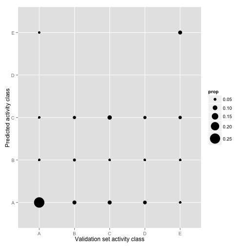
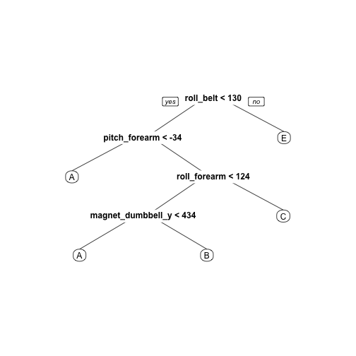
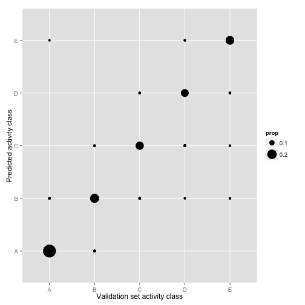

# Predicting execution of bicep curls from accelerometer data

## SYNOPSIS

Given a data set of accelerometer measurements taken while subjects were performing bicep curls in five different ways, our aim was to develop a model that could accurately predict which class of activity was being performed at any time point. I used 52 variables that provided meaningful data as predictors and tested both a classification tree method and a random forests method. Cross-validation showed that the latter was able to predict test data with high accuracy.

## OBTAINING THE DATA


The original data set was collected and published by [Velloso _et al._](http://groupware.les.inf.puc-rio.br/har). A training set was randomly sampled and provided at [https://d396qusza40orc.cloudfront.net/predmachlearn/pml-training.csv](https://d396qusza40orc.cloudfront.net/predmachlearn/pml-training.csv).

I loaded the following libraries and the CSV into R.


```r
library(ggplot2)
library(knitr)
library(caret)
library(rpart.plot)
pmlTraining <- read.csv("pml-training.csv", row.names=1)
```

```
## Warning in file(file, "rt"): cannot open file 'pml-training.csv': No such
## file or directory
```

```
## Error in file(file, "rt"): cannot open the connection
```

```r
dim(pmlTraining)
```

```
## [1] 19622   159
```

The data set contained 19,622 rows and 159 variables. Our goal was to predict the final column, `classe`, which describes the type of bicep curl performed, according to one of the five classes defined by the data's authors:

> exactly according to the specification (Class A), throwing the elbows to the front (Class B), lifting the dumbbell only halfway (Class C), lowering the dumbbell only halfway (Class D) and throwing the hips to the front (Class E).

## PARTITIONING THE DATA

In order to be able to assess the performance of any model developed, I first partitioned 40% of the provided training data into a separate set for cross-validation by random sampling.


```r
set.seed(94913491)
inTrain <- createDataPartition(y=pmlTraining$classe, p=0.6, list=FALSE)
training <- pmlTraining[inTrain,]
validating <- pmlTraining[-inTrain,]
```

I set aside the set for cross-validation and only used the remaining training data for exploratory data analysis and model fitting.

## CHOOSING PREDICTORS

An initial look at the 158 variables that could be potential predictors for `classe` showed that the first six columns contained metadata that were specific to the experiment in which the data was collected. `user_name` specified the person doing the activity; `raw_timestamp_part_1`, `raw_timestamp_part_2` and `cvtd_timestamp` recorded the time; and `new_window` and `num_window` were used by the data's authors for their sliding window analysis to calculate summary statistics.


```r
head(training[,1:6])
```

```
##   user_name raw_timestamp_part_1 raw_timestamp_part_2   cvtd_timestamp
## 1  carlitos           1323084231               788290 05/12/2011 11:23
## 3  carlitos           1323084231               820366 05/12/2011 11:23
## 6  carlitos           1323084232               304277 05/12/2011 11:23
## 7  carlitos           1323084232               368296 05/12/2011 11:23
## 8  carlitos           1323084232               440390 05/12/2011 11:23
## 9  carlitos           1323084232               484323 05/12/2011 11:23
##   new_window num_window
## 1         no         11
## 3         no         11
## 6         no         12
## 7         no         12
## 8         no         12
## 9         no         12
```

However, these variables were not useful for a generalizable model, which should be able to predict the type of activity without depending on prior information about the individual performing the exercise or on the time at which the measurements are taken. Furthermore, the model we were developing would not be given windows of time series data as input but rather single time points. Thus, I did not use these variables as predictors.

Examinining the remaining columns in the training set revealed that many had missing values, denoted either as `NA` or empty strings. Eliminating these variables left us with 52 potential predictors.


```r
missingvalues <- colSums(training[,7:158] == "")
predictors <- names(missingvalues)[which(missingvalues == 0)]
length(predictors)
```

```
## [1] 52
```

I checked to see if any of these predictors showed too little variance across the data set to be useful as predictors. The metrics used tested to see if the frequency ratio of the most common value to the second-most common value exceeded 19.0 and if the percentage of unique values out of the total number of samples was less than 10%. None of the predictors met both thresholds for having near zero variance, so I proceeded with using all 52 for fitting our model.


```r
nzvMetrics <- nearZeroVar(as.data.frame(training[,predictors]),
                          saveMetrics=TRUE)
```

## FITTING MODELS AND ASSESSING ERROR

### Classification tree

Since our goal is to predict a categorical variable, the first method I used was the classification tree algorithm implemented in `rpart`.


```r
rpartModel1 <- train(classe ~ ., 
                     data=training[,c(predictors, "classe")], 
                     method="rpart")
```

However, when I used the model to predict `classe` on the test set for cross-validation, I found that the accuracy was only about 48%, and the sensitivity of the model varied hugely among the five classes. In particular, the model was completely unable to predict class D.


```r
rpartPredict1 <- predict(rpartModel1, newdata=validating[,predictors])
confusionMatrix(rpartPredict1, validating$classe)
```

```
## Confusion Matrix and Statistics
## 
##           Reference
## Prediction    A    B    C    D    E
##          A 2006  634  641  577  228
##          B   40  409   22  243   87
##          C  181  475  705  466  500
##          D    0    0    0    0    0
##          E    5    0    0    0  627
## 
## Overall Statistics
##                                           
##                Accuracy : 0.4776          
##                  95% CI : (0.4665, 0.4887)
##     No Information Rate : 0.2845          
##     P-Value [Acc > NIR] : < 2.2e-16       
##                                           
##                   Kappa : 0.3176          
##  Mcnemar's Test P-Value : NA              
## 
## Statistics by Class:
## 
##                      Class: A Class: B Class: C Class: D Class: E
## Sensitivity            0.8987  0.26943  0.51535   0.0000  0.43481
## Specificity            0.6295  0.93805  0.74961   1.0000  0.99922
## Pos Pred Value         0.4909  0.51061  0.30297      NaN  0.99209
## Neg Pred Value         0.9399  0.84258  0.87987   0.8361  0.88703
## Prevalence             0.2845  0.19347  0.17436   0.1639  0.18379
## Detection Rate         0.2557  0.05213  0.08985   0.0000  0.07991
## Detection Prevalence   0.5208  0.10209  0.29658   0.0000  0.08055
## Balanced Accuracy      0.7641  0.60374  0.63248   0.5000  0.71702
```

```r
rpartPlot <- ggplot(data=validating, 
                    aes(x=classe, y=rpartPredict1)) +
  geom_point() + 
  xlab("Validation set activity class") +
  ylab("Predicted activity class") +
  scale_y_discrete(limits=c("A","B","C","D","E")) +
  stat_sum(aes(group=1)) +
  scale_size(range=c(1,10))
rpartPlot
```

 

The reason became clear when looking at the decision tree resulting from the model: there is no leaf that results in class D.


```r
prp(rpartModel1$finalModel, varlen=0)
```

 

### Random forests

Next, I used a random forests algorithm implemented in `randomForest`, which creates multiple classification trees through bootstrapping and votes on the majority result from all the trees. Thus, the prediction method is less vulnerable to the weaknesses of any one given classification tree.


```r
rfModel1 <- train(classe ~ .,
                  data=training[,c(predictors, "classe")],
                  method="rf")
```

This method had 99% accuracy when cross-validated against the test data set and seemed to predict all five classes with similar sensitiviy.


```r
rfPredict1 <- predict(rfModel1, newdata=validating[,predictors])
confusionMatrix(rfPredict1, validating$classe)
```

```
## Confusion Matrix and Statistics
## 
##           Reference
## Prediction    A    B    C    D    E
##          A 2226   14    0    0    0
##          B    5 1500   12    1    2
##          C    0    4 1350   21    2
##          D    0    0    6 1262    7
##          E    1    0    0    2 1431
## 
## Overall Statistics
##                                           
##                Accuracy : 0.9902          
##                  95% CI : (0.9877, 0.9922)
##     No Information Rate : 0.2845          
##     P-Value [Acc > NIR] : < 2.2e-16       
##                                           
##                   Kappa : 0.9876          
##  Mcnemar's Test P-Value : NA              
## 
## Statistics by Class:
## 
##                      Class: A Class: B Class: C Class: D Class: E
## Sensitivity            0.9973   0.9881   0.9868   0.9813   0.9924
## Specificity            0.9975   0.9968   0.9958   0.9980   0.9995
## Pos Pred Value         0.9938   0.9868   0.9804   0.9898   0.9979
## Neg Pred Value         0.9989   0.9972   0.9972   0.9963   0.9983
## Prevalence             0.2845   0.1935   0.1744   0.1639   0.1838
## Detection Rate         0.2837   0.1912   0.1721   0.1608   0.1824
## Detection Prevalence   0.2855   0.1937   0.1755   0.1625   0.1828
## Balanced Accuracy      0.9974   0.9925   0.9913   0.9897   0.9960
```

```r
rfPlot <- ggplot(data=validating, 
                 aes(x=classe, y=rfPredict1)) +
  geom_point() + 
  xlab("Validation set activity class") +
  ylab("Predicted activity class") +
  stat_sum(aes(group=1)) +
  scale_size(range=c(1,10))
rfPlot
```

 

